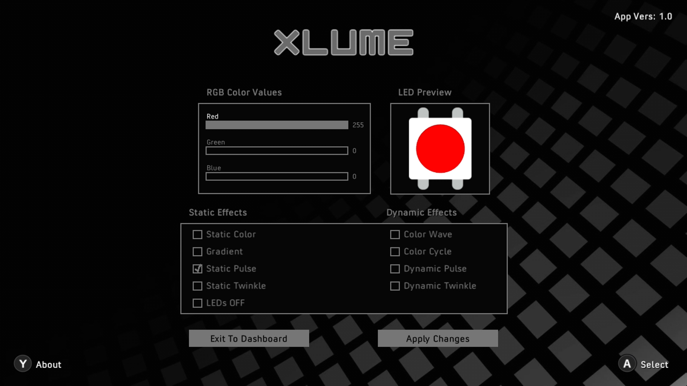
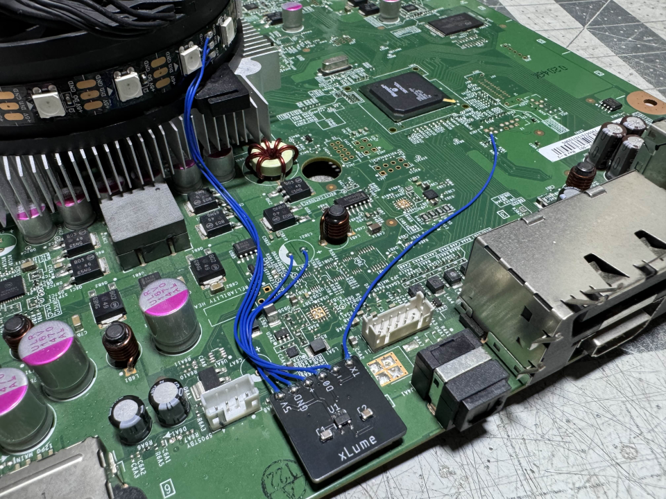
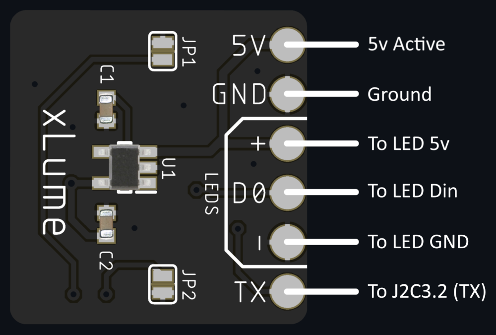

# xLume
xLume is an LED controller project built with the ESP8266. It works with the alongside the xLume Xbox application and connects via UART to receive commands from the 360. The following is a breakdown of the current commands that can be called to activate the different colors and modes.

> [!IMPORTANT]  
> In order for xLume to function properly please ensure that you have debug output enabled in your dashlaunch launch.ini
> 
> debugout = true
 
The following commands should be passed over UART (this is done via the Xbox xLume app). The first is the main commmand and passes a color to the controller/LEDs which serves as a basis for most of the effects below. In this example we're setting the R, G, B value to Blue at full brightness.  
<b>(Set Color)</b> 
[xLume] - 0, 0, 255  

<b>(Static Color)</b> 
[xLume] - Effects: 0 

<b>(Static Gradient)</b> 
[xLume] - Effects: 1 

<b>(Static Pulse)</b> 
[xLume] - Effects: 2 

<b>(Static Twinkle)</b> 
[xLume] - Effects: 3 

<b>(Turn off LEDs)</b> 
[xLume] - Effects: 4 

<b>(Color Wave)</b> 
[xLume] - Effects: 5 

<b>(Color Cycle)</b> 
[xLume] - Effects: 6 

<b>(Dynamic Pulse)</b> 
[xLume] - Effects: 7 

<b>(Dynamic Twinkle)</b> 
[xLume] - Effects: 8 

<b>Setting your LED count</b> 
[xLume] - ledCount: 10

### Demo Video:  

## Installation Example

## Simple Wiring Diagram

Recommended LED Strips: https://a.co/d/2hvjQGv 
Recommended Programmer: https://a.co/d/huijcmV
